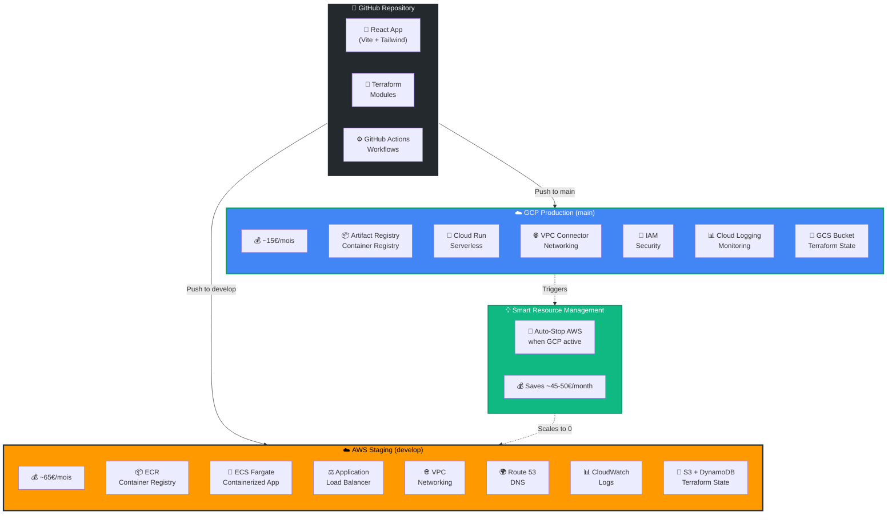
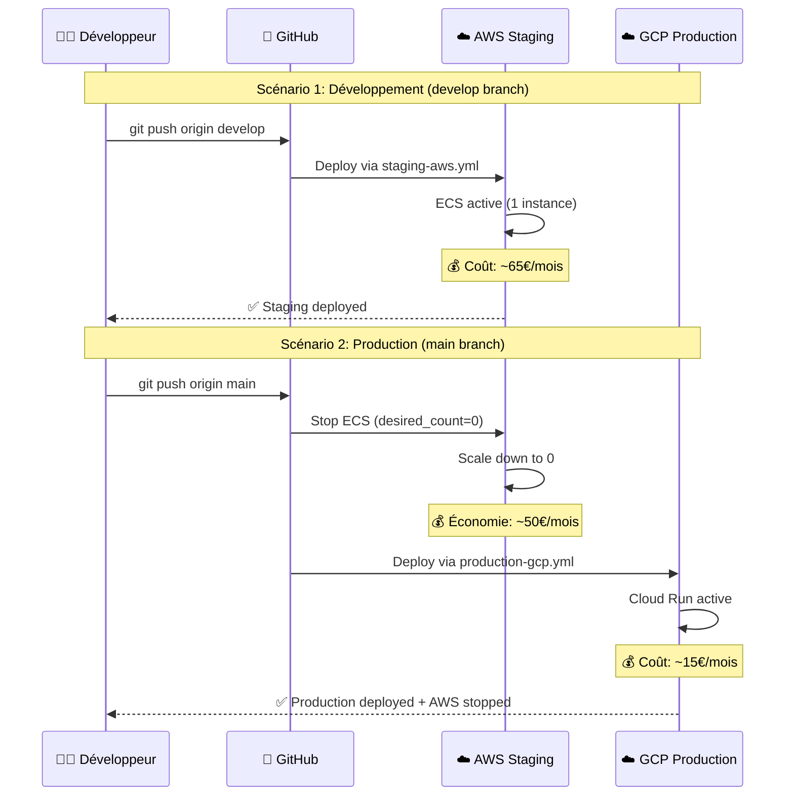
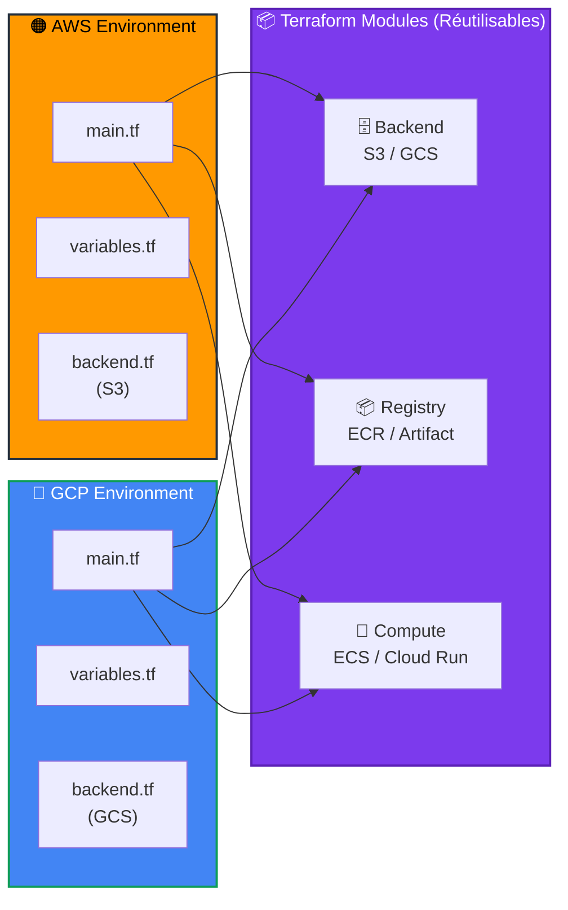
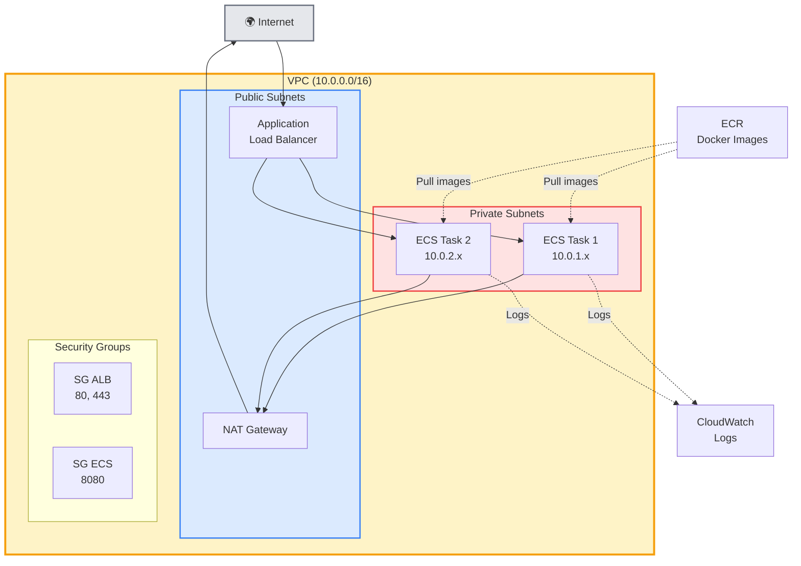
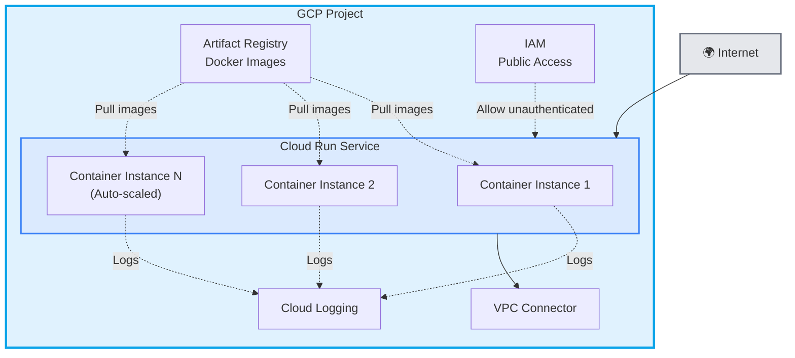
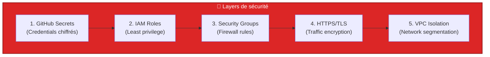

# 🏗️ Architecture Multi-Cloud

## Vue d'ensemble de l'infrastructure

## 🎯 Flux de déploiement intelligent

## 🔄 Architecture des modules Terraform

## 🌐 Architecture réseau détaillée

### AWS ECS Fargate

### GCP Cloud Run

## 📊 Comparaison des services

| Composant | AWS | GCP |
|-----------|-----|-----|
| **Container Registry** | ECR | Artifact Registry |
| **Compute** | ECS Fargate | Cloud Run |
| **Load Balancer** | Application LB | Built-in (serverless) |
| **Networking** | VPC + Subnets | VPC Connector |
| **DNS** | Route 53 | Cloud DNS |
| **Logs** | CloudWatch | Cloud Logging |
| **State Backend** | S3 + DynamoDB | GCS |
| **Cost (monthly)** | ~65€ | ~15€ |
| **Scaling** | ECS Service (min/max) | Auto (0 to N) |
| **Startup** | ~30-60s | ~5-10s |

## 💡 Décisions d'architecture

### Pourquoi deux clouds ?

1. **Compétences multi-cloud** : Démonstration de maîtrise AWS + GCP
2. **Optimisation coûts** : GCP Cloud Run moins cher pour production (~70% d'économie)
3. **Résilience** : Capacité de basculer entre clouds si besoin
4. **Apprentissage** : Expérience concrète des deux écosystèmes

### Pourquoi ce split develop/main ?

1. **Économie** : Un seul environnement actif = ~45-50€/mois économisés
2. **Réaliste** : Simule un vrai workflow staging → production
3. **Automatisation** : Déploiement et arrêt entièrement automatisés
4. **Flexibilité** : Facile de tester les deux environnements

### Choix techniques

| Décision | Justification |
|----------|---------------|
| **Terraform modules réutilisables** | Code DRY, facile à maintenir |
| **Remote state backend** | Collaboration, lock, versioning |
| **Docker multi-stage** | Images légères (~50MB vs ~1GB) |
| **Nginx** | Performance, configuration flexible |
| **Import scripts** | Évite conflits "already exists" |
| **Health checks** | Validation automatique post-déploiement |

## 🔐 Sécurité

---

**Dernière mise à jour** : Octobre 2025  
**Version** : 1.0
