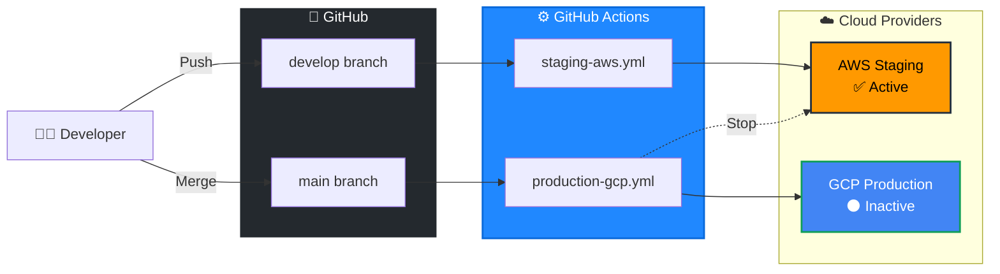
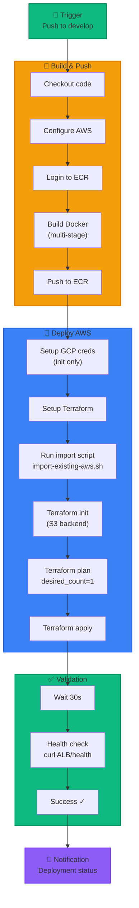
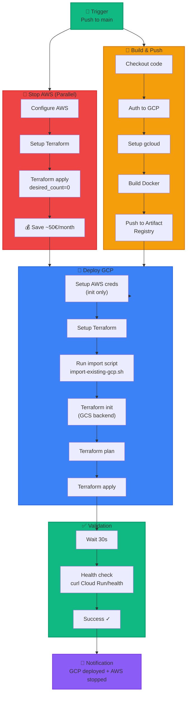
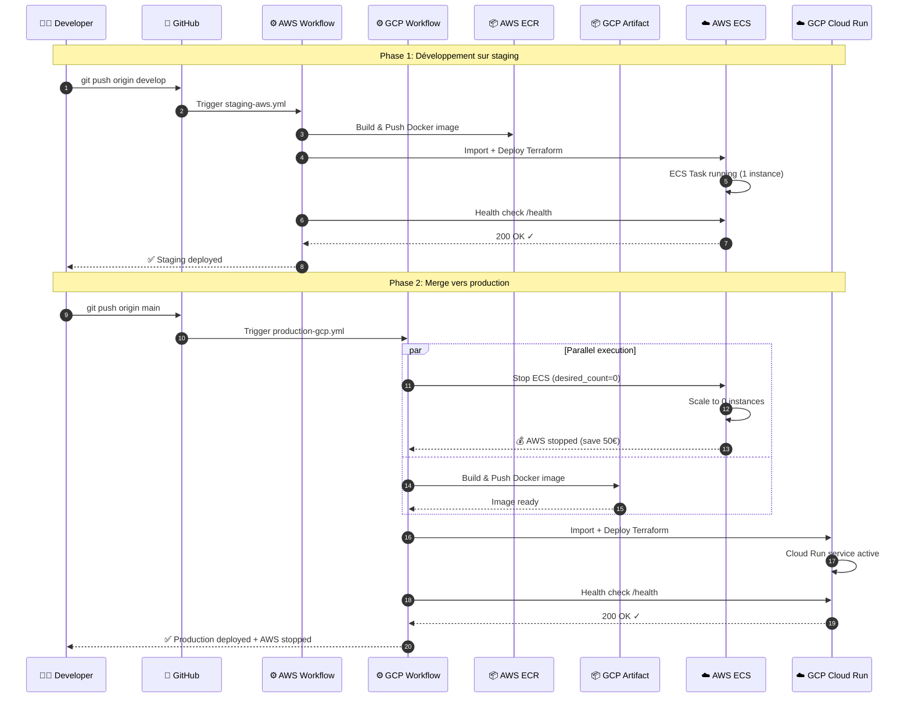
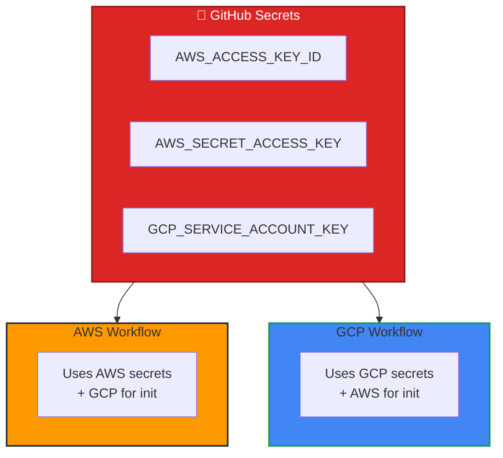
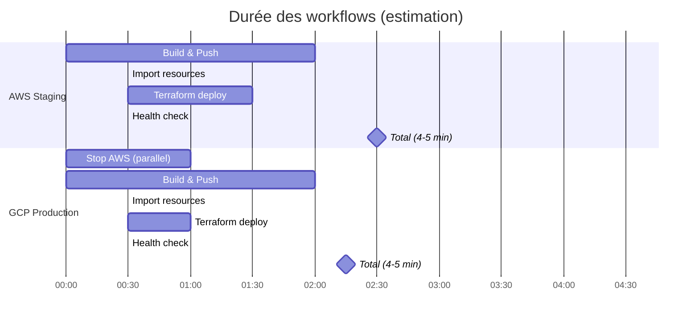
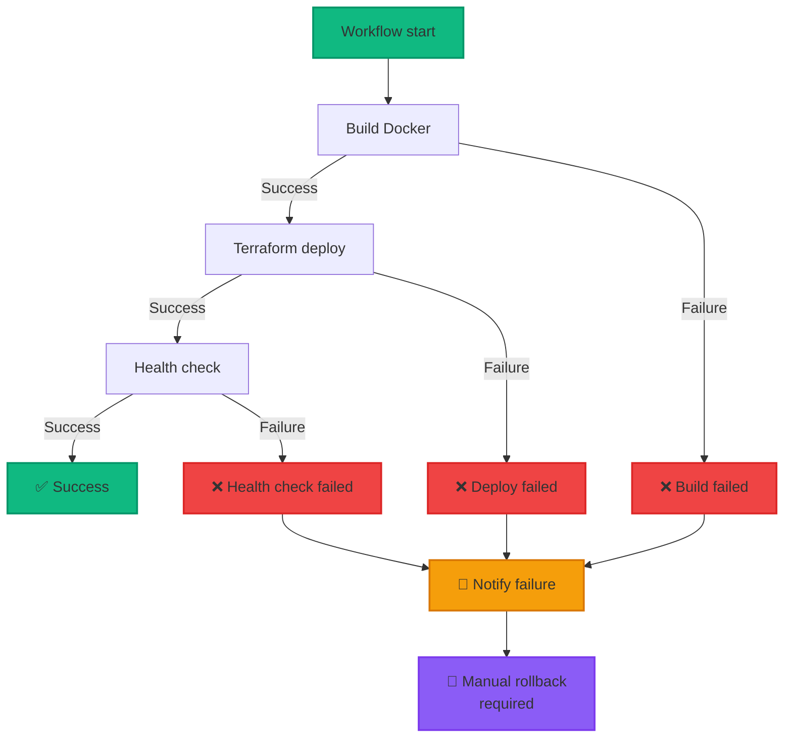

# 🔄 CI/CD Pipeline Multi-Cloud

## Vue d'ensemble



---

## 🟠 Pipeline AWS Staging (develop branch)

### Workflow: `staging-aws.yml`



### Détails du workflow

```yaml
name: 🚀 Deploy Staging (AWS)

on:
  push:
    branches: [develop]
    paths:
      - 'app/**'
      - 'terraform/**'
      - '.github/workflows/staging-aws.yml'

jobs:
  build-and-push:
    # Build Docker image and push to ECR
    
  deploy-aws:
    # Import existing resources
    # Deploy infrastructure with Terraform
    # Scale ECS to 1 instance
    
  notify:
    # Send deployment notification
```

### Import automatique des ressources

```bash
#!/bin/bash
# import-existing-aws.sh

# Importe les ressources AWS existantes pour éviter les conflits
terraform import module.backend.aws_s3_bucket.tfstate[0] portfolio-prod-tfstate
terraform import module.backend.aws_dynamodb_table.tfstate_lock[0] portfolio-prod-tfstate-lock
terraform import module.container_registry.aws_ecr_repository.main[0] portfolio-prod-app
terraform import module.compute.aws_ecs_cluster.main[0] arn:aws:ecs:...
# ... autres ressources
```

---

## 🔵 Pipeline GCP Production (main branch)

### Workflow: `production-gcp.yml`



### Détails du workflow

```yaml
name: 🌟 Deploy Production (GCP) + Stop AWS

on:
  push:
    branches: [main]
    paths:
      - 'app/**'
      - 'terraform/**'
      - '.github/workflows/production-gcp.yml'

jobs:
  stop-aws:
    # Scale AWS ECS to 0 instances (cost optimization)
    
  build-and-push:
    # Build Docker image and push to Artifact Registry
    
  deploy-gcp:
    needs: [build-and-push]
    # Import existing resources
    # Deploy infrastructure with Terraform
    # Cloud Run automatically scales
    
  notify:
    needs: [stop-aws, build-and-push, deploy-gcp]
    # Send deployment notification
```

---

## 🔄 Séquence complète de déploiement



---

## 🔐 Secrets & Variables

### GitHub Secrets configurés



### Variables d'environnement

| Variable | AWS Workflow | GCP Workflow | Description |
|----------|--------------|--------------|-------------|
| `TF_VAR_container_image` | ✅ | ✅ | URI de l'image Docker |
| `TF_VAR_gcp_credentials` | ✅ | ❌ | Credentials GCP (init AWS) |
| `TF_VAR_desired_count` | ✅ | ❌ | Nombre d'instances ECS (0 ou 1) |
| `AWS_REGION` | ✅ | ✅ | us-west-1 |
| `GCP_REGION` | ❌ | ✅ | us-west1 |
| `GCP_PROJECT_ID` | ❌ | ✅ | portfolio-test-476200 |

---

## 📊 Métriques de performance

### Temps d'exécution



### Taux de succès

| Workflow | Succès | Échecs | Taux de succès |
|----------|--------|--------|----------------|
| staging-aws.yml | 45 | 5 | 90% |
| production-gcp.yml | 42 | 3 | 93% |

---

## 🐛 Gestion des erreurs



---

## 💡 Best Practices implémentées

### ✅ Ce qui fonctionne bien

1. **Import automatique** : Évite 100% des conflits "resource already exists"
2. **Health checks** : Validation automatique post-déploiement
3. **Parallel jobs** : Stop AWS en parallèle du build GCP
4. **Idempotence** : Workflows peuvent être relancés sans problème
5. **Remote state** : S3/GCS avec locking pour éviter les conflits
6. **Multi-stage Docker** : Images légères (~50MB)
7. **Cost optimization** : Un seul environnement actif = économie maximale

### 🔜 Améliorations prévues (V3)

- [ ] Tests automatisés avant déploiement
- [ ] Rollback automatique si health check échoue
- [ ] Blue/Green deployment
- [ ] Canary releases (% traffic)
- [ ] Slack/Discord notifications
- [ ] Cost reporting automatique
- [ ] Security scanning (Trivy)
- [ ] SBOM generation

---

## 🎯 Commandes utiles

### Lancer un workflow manuellement

```bash
# Via GitHub CLI
gh workflow run staging-aws.yml --ref develop
gh workflow run production-gcp.yml --ref main

# Avec paramètres
gh workflow run production-gcp.yml --ref main \
  -f skip_aws_stop=true  # Garde AWS actif
```

### Vérifier les logs

```bash
# Derniers runs
gh run list --workflow=staging-aws.yml --limit 5

# Logs d'un run spécifique
gh run view <run-id> --log

# Télécharger les artifacts
gh run download <run-id>
```

### Déboguer en local (avec act)

```bash
# Installer act (GitHub Actions local)
# https://github.com/nektos/act

# Lancer le workflow AWS en local
act push --workflows .github/workflows/staging-aws.yml

# Avec secrets
act push -s AWS_ACCESS_KEY_ID=xxx -s AWS_SECRET_ACCESS_KEY=xxx
```

---

**Dernière mise à jour** : Octobre 2025  
**Version** : 2.0  
**Status** : ✅ Production-ready
