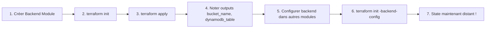

# 🗄️ Backend State Management Module

## 📋 Description

Ce module Terraform crée l'infrastructure nécessaire pour stocker le **state Terraform** de manière sécurisée et collaborative.

### Qu'est-ce que le State ?

Le **state** (`terraform.tfstate`) est un fichier JSON qui enregistre :
- Toutes les ressources créées par Terraform
- Leurs attributs (IDs, IPs, URLs, etc.)
- Les dépendances entre ressources

**Par défaut**, le state est stocké localement dans `terraform.tfstate`.

**Problème** : Si tu travailles en équipe ou sur plusieurs machines, chacun a son propre state local → **CHAOS** 😱

### Solution : Backend Distant

Ce module crée un **backend distant** pour :
- ✅ **Partager le state** entre toute l'équipe
- ✅ **Verrouiller le state** (state locking) pour éviter les modifications concurrentes
- ✅ **Versionner le state** pour revenir en arrière si nécessaire
- ✅ **Chiffrer le state** pour la sécurité

---

## 🏗️ Architecture

### AWS
```
┌─────────────────────────────────────────┐
│         S3 Bucket                       │
│  portfolio-prod-tfstate                 │
│  ┌───────────────────────────────────┐  │
│  │  terraform.tfstate (chiffré)      │  │
│  │  - Versioning: Enabled            │  │
│  │  - Encryption: AES-256            │  │
│  │  - Public Access: BLOCKED         │  │
│  └───────────────────────────────────┘  │
└─────────────────────────────────────────┘
                  │
                  │ State Locking
                  ▼
┌─────────────────────────────────────────┐
│       DynamoDB Table                    │
│  portfolio-prod-tfstate-lock            │
│  ┌───────────────────────────────────┐  │
│  │  LockID (Hash Key)                │  │
│  │  - Prevents concurrent access     │  │
│  └───────────────────────────────────┘  │
└─────────────────────────────────────────┘
```

### GCP
```
┌─────────────────────────────────────────┐
│      GCS Bucket                         │
│  portfolio-prod-tfstate                 │
│  ┌───────────────────────────────────┐  │
│  │  terraform/state/default.tfstate  │  │
│  │  - Versioning: Enabled            │  │
│  │  - Encryption: Default GCP KMS    │  │
│  │  - Uniform Access: Enabled        │  │
│  │  - Native Locking: Enabled        │  │
│  └───────────────────────────────────┘  │
└─────────────────────────────────────────┘
```

---

## 📦 Ressources Créées

### AWS (si `cloud_provider = "aws"`)
1. **S3 Bucket** : Stockage du state
2. **S3 Bucket Versioning** : Historique des versions
3. **S3 Bucket Encryption** : Chiffrement AES-256
4. **S3 Public Access Block** : Bloque l'accès public
5. **DynamoDB Table** : State locking

### GCP (si `cloud_provider = "gcp"`)
1. **GCS Bucket** : Stockage du state avec versioning et chiffrement intégrés
2. **IAM Policy** : Empêche l'accès public

---

## 🚀 Utilisation

### Exemple AWS

```hcl
module "backend" {
  source = "./modules/backend"

  cloud_provider   = "aws"
  project_name     = "portfolio"
  environment      = "prod"
  region           = "us-east-1"
  enable_versioning = true
  enable_encryption = true

  tags = {
    Project   = "Portfolio"
    ManagedBy = "Terraform"
  }
}
```

### Exemple GCP

```hcl
module "backend" {
  source = "./modules/backend"

  cloud_provider   = "gcp"
  project_name     = "portfolio"
  environment      = "prod"
  gcp_project_id   = "my-gcp-project"
  gcp_region       = "us-central1"
  enable_versioning = true
  enable_encryption = true

  tags = {
    project    = "portfolio"
    managed_by = "terraform"
  }
}
```

---

## 📤 Outputs

| Output | Description | AWS | GCP |
|--------|-------------|-----|-----|
| `bucket_name` | Nom du bucket | ✅ | ✅ |
| `bucket_url` | URL complète (s3:// ou gs://) | ✅ | ✅ |
| `bucket_arn` | ARN du bucket S3 | ✅ | ❌ |
| `dynamodb_table` | Nom de la table DynamoDB | ✅ | ❌ |
| `dynamodb_table_arn` | ARN de la table DynamoDB | ✅ | ❌ |
| `region` | Région des ressources | ✅ | ✅ |
| `backend_config` | Config backend prête à l'emploi | ✅ | ✅ |
| `versioning_enabled` | Status du versioning | ✅ | ✅ |
| `encryption_enabled` | Status du chiffrement | ✅ | ✅ |

---

## 🔧 Configuration du Backend dans d'autres projets

Après avoir créé ce module, tu dois **configurer le backend** dans tes autres projets Terraform.

### Méthode 1 : Configuration manuelle (AWS)

```hcl
terraform {
  backend "s3" {
    bucket         = "portfolio-prod-tfstate"      # Récupéré de module.backend.bucket_name
    key            = "compute/terraform.tfstate"   # Chemin unique pour ce projet
    region         = "us-east-1"
    dynamodb_table = "portfolio-prod-tfstate-lock" # Récupéré de module.backend.dynamodb_table
    encrypt        = true
  }
}
```

### Méthode 2 : Configuration manuelle (GCP)

```hcl
terraform {
  backend "gcs" {
    bucket = "portfolio-prod-tfstate"       # Récupéré de module.backend.bucket_name
    prefix = "compute/terraform/state"      # Chemin unique pour ce projet
  }
}
```

### Méthode 3 : Backend config file (recommandé)

1. Créer un fichier `backend.tfvars` :

**AWS** :
```hcl
bucket         = "portfolio-prod-tfstate"
key            = "compute/terraform.tfstate"
region         = "us-east-1"
dynamodb_table = "portfolio-prod-tfstate-lock"
encrypt        = true
```

**GCP** :
```hcl
bucket = "portfolio-prod-tfstate"
prefix = "compute/terraform/state"
```

2. Initialiser Terraform avec ce fichier :
```bash
terraform init -backend-config=backend.tfvars
```

---

## 📋 Variables d'Entrée

| Variable | Type | Requis | Défaut | Description |
|----------|------|--------|--------|-------------|
| `cloud_provider` | string | ✅ | - | Provider cloud (`aws` ou `gcp`) |
| `project_name` | string | ✅ | - | Nom du projet (3-30 caractères alphanumériques) |
| `environment` | string | ❌ | `prod` | Environnement (`dev`, `staging`, `prod`) |
| `region` | string | ❌ | `us-east-1` | Région AWS |
| `gcp_project_id` | string | ⚠️* | - | ID du projet GCP (*requis si GCP) |
| `gcp_region` | string | ❌ | `us-central1` | Région GCP |
| `enable_versioning` | bool | ❌ | `true` | Activer le versioning |
| `enable_encryption` | bool | ❌ | `true` | Activer le chiffrement |
| `tags` | map(string) | ❌ | `{}` | Tags à appliquer aux ressources |

---

## 🔒 Sécurité

- ✅ **Chiffrement au repos** : AES-256 (AWS) ou KMS par défaut (GCP)
- ✅ **Accès bloqué** : Aucun accès public possible
- ✅ **Versioning** : Garde l'historique complet du state
- ✅ **State Locking** : Empêche les modifications concurrentes

---

## 🧪 Tests

### 1. Valider la configuration
```bash
cd terraform/modules/backend
terraform init
terraform validate
```

### 2. Simuler la création
```bash
terraform plan -var="cloud_provider=aws" -var="project_name=portfolio"
```

### 3. Créer les ressources
```bash
terraform apply -var="cloud_provider=aws" -var="project_name=portfolio"
```

### 4. Vérifier les outputs
```bash
terraform output
```

---

## 🛠️ Prérequis

### AWS
- AWS CLI installé et configuré (`aws configure`)
- Credentials avec les permissions :
  - `s3:CreateBucket`, `s3:PutBucketVersioning`, `s3:PutEncryptionConfiguration`
  - `dynamodb:CreateTable`, `dynamodb:DescribeTable`

### GCP
- Google Cloud SDK installé (`gcloud init`)
- Credentials avec les permissions :
  - `storage.buckets.create`, `storage.buckets.update`
  - `storage.buckets.setIamPolicy`

---

## 🔄 Workflow de Déploiement



---

## 📝 Notes

### Pourquoi créer le backend en premier ?

Le backend **ne peut pas utiliser son propre state distant** (chicken-and-egg problem).

**Solution** :
1. Créer ce module avec state **local** (`terraform.tfstate` local)
2. Noter les outputs (`bucket_name`, `dynamodb_table`)
3. Migrer le state local vers le backend distant :

```bash
# Ajouter le backend dans ce module
terraform {
  backend "s3" {
    bucket         = "portfolio-prod-tfstate"
    key            = "backend/terraform.tfstate"
    region         = "us-east-1"
    dynamodb_table = "portfolio-prod-tfstate-lock"
    encrypt        = true
  }
}

# Migrer le state
terraform init -migrate-state
```

### State Locking : AWS vs GCP

- **AWS** : Utilise DynamoDB pour le locking (table séparée)
- **GCP** : Locking natif dans GCS (pas de ressource supplémentaire)

---

## 🆘 Troubleshooting

### Erreur : Bucket name already exists
```
Error: Error creating S3 bucket: BucketAlreadyExists
```

**Solution** : Les noms de buckets S3 sont globalement uniques. Change `project_name` ou ajoute un suffixe random.

### Erreur : DynamoDB table already exists
```
Error: ResourceInUseException: Table already exists
```

**Solution** : Vérifie que tu n'as pas déjà une table avec ce nom dans ta région.

### Erreur : Access Denied
```
Error: AccessDenied: Access Denied
```

**Solution** : Vérifie tes credentials AWS/GCP et leurs permissions.

---

## 📚 Ressources

- [Terraform Backend Configuration](https://www.terraform.io/language/settings/backends/configuration)
- [S3 Backend](https://www.terraform.io/language/settings/backends/s3)
- [GCS Backend](https://www.terraform.io/language/settings/backends/gcs)
- [State Locking](https://www.terraform.io/language/state/locking)

---

**Auteur** : Portfolio Project  
**Version** : 1.0.0  
**Dernière mise à jour** : 2025
